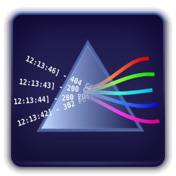

LogO'Prism: Animate your log stream!
====================================================================================================



COMPILING
````````````````````````````````````````````````````````````````````````````````````````````````````

LogO'Prism builds with CMake_ and the following platforms are supported, as long as the
dependencies are available.


Linux
~~~~~~~~~~~~~~~~~~~~~~~~~~~~~~~~~~~~~~~~~~~~~~~~~~~~~~~~~~~~~~~~~~~~~~~~~~~~~~~~~~~~~~~~~~~~~~~~~~~~

On Linux, required tools and libraries can usually be found in your favorite distribution's package
manager, however the package names can differ from distribution to distribution.

- GCC_ >= 4.7, or Clang_ >= 3.2 are required for C++11 support
- CMake_ >= 2.8.10
- p7zip
- Pango
- Cairo
- GStreamer >= 1.0
- Glm
- Boost >= 1.52

.. code:: bash

  git submodule update --init
  mkdir build && cd build
  cmake ..
  make


MacOSX
~~~~~~~~~~~~~~~~~~~~~~~~~~~~~~~~~~~~~~~~~~~~~~~~~~~~~~~~~~~~~~~~~~~~~~~~~~~~~~~~~~~~~~~~~~~~~~~~~~~~

- Mountain Lion 10.8.2 with up-to-date XCode Command Line Tools are required for C++11 support
- Homebrew_ can be used to get dependencies:
.. code:: bash

  brew install cmake
  brew install p7zip
  brew install pango
  brew install glm
  brew install boost --with-c++11
  brew install gst-libav gst-plugins-bad gst-plugins-base gst-plugins-good gst-plugins-ugly gstreamer

- XQuartz_ is required for X11 libraries

.. code:: bash

  git submodule update --init
  mkdir build && cd build
  export PKG_CONFIG_PATH=/usr/local/lib/pkgconfig:/opt/X11/lib/pkgconfig/
  CC=clang CXX=clang++ cmake -DCMAKE_OSX_ARCHITECTURES=x86_64 ..
  make


Windows
~~~~~~~~~~~~~~~~~~~~~~~~~~~~~~~~~~~~~~~~~~~~~~~~~~~~~~~~~~~~~~~~~~~~~~~~~~~~~~~~~~~~~~~~~~~~~~~~~~~~

On Windows, pre-built dependencies will automatically be downloaded by CMake_ the first time
LogO'Prism is built. Library artifacts will be stored in the ``lib`` folder.

- Visual Studio >= 2012 is required for C++11 support
- 7Zip_ is required for dependency automatic download
- CMake_ >= 2.8.10 is required for Visual Studio 2012 support

Use CMake_ to generate the Visual Studio solution, and choose ``Visual Studio 11`` as the generator.


USAGE
````````````````````````````````````````````````````````````````````````````````````````````````````

Use the ``etc/logoprism.conf`` as a sample configuration file that has to be located in the same
folder as the ``logoprism`` binary.

The following key combination are recognized:

- ``Space``: pause/resume
- ``+/-``: speed up/slow down
- ``Right/Shift+Right/Ctrl+Right/Alt+Right/Ctrl+Alt+Right``: fast forward at different speed
- ``O/L``: increase/reduce number of tokens on the left side of the screen
- ``P/M``: increase/reduce number of tokens on the right side of the screen


COPYING INFORMATION
````````````````````````````````````````````````````````````````````````````````````````````````````
 Distributed under the Creative Commons BY-NC-ND License, Version 3.0

 See accompanying file LICENSE or copy at `CC BY-NC-ND 3.0 <http://creativecommons.org/licenses/by-nc-nd/3.0/legalcode.txt>`_

.. _CMake: http://cmake.org
.. _GCC: http://gcc.gnu.org
.. _Clang: http://clang.llvm.org
.. _Homebrew: http://mxcl.github.io/homebrew
.. _7Zip: http://www.7-zip.org
.. _XQuartz: http://xquartz.macosforge.org/landing
